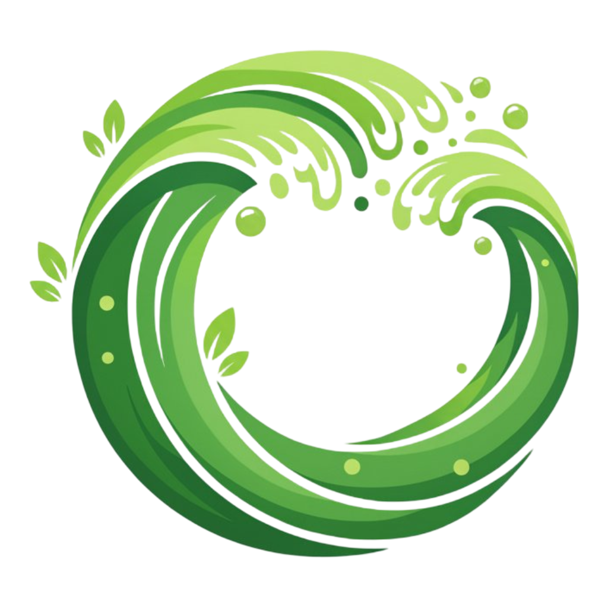

<div align="center">



# **OXYDIUS**

### *Bangun, Bertahan, Taklukkan*

<br>


<br>

Sistem manajemen website clan Minecraft untuk [ProwNetwork](https://prownetwork.id) — dilengkapi panel admin, registrasi anggota, galeri, dan profil 3D Minecraft.

**[Live Demo](https://oxydius.oxyda.id)**

</div>

---

## Daftar Isi

- [Fitur Utama](#fitur-utama)
- [Arsitektur](#arsitektur)
- [Teknologi yang Digunakan](#teknologi-yang-digunakan)
- [Struktur Proyek](#struktur-proyek)
- [Persiapan & Instalasi](#persiapan--instalasi)
- [Perintah yang Tersedia](#perintah-yang-tersedia)
- [Konfigurasi Environment](#konfigurasi-environment)
- [Dokumentasi API & Rute](#dokumentasi-api--rute)
- [Database](#database)
- [Testing](#testing)
- [Deployment](#deployment)
- [Kontribusi](#kontribusi)
- [Lisensi](#lisensi)

---

## Fitur Utama

### 🌐 Website Publik

| Fitur | Deskripsi |
|:------|:----------|
| **Halaman Utama** | Hero section dinamis, showcase divisi, galeri foto carousel, dan rendering 3D Minecraft skin |
| **Divisi** | Jelajahi semua divisi clan beserta jumlah anggota dan pemimpinnya |
| **Direktori Anggota** | Daftar anggota ter-paginasi dengan pencarian dan sorting (pemimpin di atas) |
| **Profil Pengguna** | Halaman profil publik untuk setiap anggota dengan gamertag, divisi, dan tag |
| **Galeri Foto** | Galeri ter-paginasi dengan pencarian dan toggle aktif/nonaktif |
| **Formulir Pendaftaran** | Aplikasi keanggotaan lengkap dengan validasi, pemilihan divisi, motivasi, dan keahlian |

### 🔐 Autentikasi & Keamanan

| Fitur | Deskripsi |
|:------|:----------|
| **Login / Register** | Autentikasi penuh via Laravel Fortify |
| **Two-Factor Authentication** | Dukungan 2FA untuk keamanan akun |
| **Manajemen Password** | Ubah password dengan konfirmasi keamanan |
| **Pengaturan Profil** | Edit nama, email, gamertag, telepon, avatar, dan skin Minecraft |

### ⚙️ Panel Admin (`/admin`)

| Fitur | Deskripsi |
|:------|:----------|
| **Dashboard** | Ringkasan statistik — total divisi, anggota, pemimpin, anggota terbaru |
| **Manajemen Anggota** | CRUD lengkap untuk anggota clan (user + data profil Minecraft) |
| **Manajemen Divisi** | Kelola divisi dengan auto-slug, ikon, dan deskripsi |
| **Review Pendaftaran** | Tinjau aplikasi masuk — setujui (otomatis buat akun) atau tolak dengan notifikasi |
| **Manajemen Galeri** | Upload, edit, hapus foto dengan toggle status aktif |
| **Manajemen Tag** | Kelola tag dengan color picker dan ikon |
| **Pengaturan Aplikasi** | Tema warna, background hero, dan toggle pendaftaran buka/tutup |

---

## Arsitektur

```
┌──────────────────────────────────────────────────────────┐
│                      BROWSER                             │
│  ┌─────────────┐  ┌──────────────┐  ┌────────────────┐  │
│  │ Blade Views │  │   Livewire   │  │   Alpine.js    │  │
│  │ + Flux UI   │  │   Components │  │ + skinview3d   │  │
│  └──────┬──────┘  └──────┬───────┘  └────────┬───────┘  │
└─────────┼────────────────┼───────────────────┼───────────┘
          │                │                   │
┌─────────┼────────────────┼───────────────────┼───────────┐
│  LARAVEL│   LAYER        │                   │           │
│  ┌──────┴──────┐  ┌──────┴───────┐  ┌───────┴────────┐  │
│  │   Fortify   │  │  Livewire    │  │  Filament v3   │  │
│  │ Auth + 2FA  │  │  Volt (SPA)  │  │  Admin Panel   │  │
│  └──────┬──────┘  └──────┬───────┘  └───────┬────────┘  │
│         │                │                   │           │
│  ┌──────┴────────────────┴───────────────────┴────────┐  │
│  │              Eloquent ORM (7 Models)               │  │
│  │  User · ClanMember · Division · Tag · Registration │  │
│  │  Gallery · AppSetting                             │  │
│  └──────────────────────┬─────────────────────────────┘  │
│                         │                                │
│  ┌──────────────────────┴─────────────────────────────┐  │
│  │                   MySQL                            │  │
│  └────────────────────────────────────────────────────┘  │
└──────────────────────────────────────────────────────────┘
```

**Prinsip Arsitektur:**
- **Tanpa Controller Tradisional** — Semua logika frontend ditangani oleh Livewire components
- **Livewire Volt** — Komponen single-file (PHP + Blade dalam satu file) untuk pengalaman SPA-like
- **Filament v3** — Panel admin terpisah dengan auto-discovery resource
- **Role-based Access** — Hanya user dengan `is_admin = true` yang dapat mengakses panel admin

---

## Teknologi yang Digunakan

### Backend

| Teknologi | Versi | Fungsi |
|:----------|:------|:-------|
| PHP | ^8.2 | Bahasa pemrograman utama |
| Laravel | ^12.0 | Framework PHP full-stack |
| Livewire | ^3.x | Komponen reaktif tanpa API |
| Livewire Volt | ^1.7 | Komponen single-file |
| Livewire Flux | ^2.1 | Library komponen UI |
| Filament | ^3.3 | Panel admin |
| Laravel Fortify | ^1.30 | Autentikasi & 2FA |

### Frontend

| Teknologi | Versi | Fungsi |
|:----------|:------|:-------|
| Tailwind CSS | ^4.0 | CSS utility-first framework |
| Vite | ^7.0 | Build tool & dev server |
| Alpine.js | — | Interaktivitas ringan (via Livewire) |
| skinview3d | ^3.4 | Rendering 3D Minecraft skin di browser |

### Database & Tools

| Teknologi | Fungsi |
|:----------|:-------|
| MySQL | Database produksi |
| SQLite | Database testing |
| Pest PHP | Framework testing |
| Laravel Pint | Code style formatter |
| Laravel Sail | Docker development environment |

---

## Struktur Proyek

```
oxydius/
├── app/
│   ├── Actions/Fortify/       # Aksi autentikasi (register, reset password)
│   ├── Filament/
│   │   ├── Pages/             # Dashboard & Settings admin
│   │   ├── Resources/         # 6 CRUD resources admin
│   │   └── Widgets/           # Widget statistik & registrasi terbaru
│   ├── Livewire/              # 11 komponen Livewire (halaman frontend)
│   │   ├── Home.php           # Halaman utama
│   │   ├── DivisionPage.php   # Detail divisi
│   │   ├── AllDivisionsPage.php
│   │   ├── AllMembersPage.php
│   │   ├── AllGalleryPage.php
│   │   ├── MemberProfile.php
│   │   ├── UserProfilePage.php
│   │   ├── EditProfilePage.php
│   │   ├── RegisterMemberPage.php
│   │   └── Settings/          # Profil, Password, 2FA, Appearance
│   └── Models/                # 7 Eloquent models
├── config/                    # Konfigurasi Laravel
├── database/
│   ├── migrations/            # 12 migrasi database
│   └── seeders/               # Seeder & AppSettingSeeder
├── public/
│   ├── build/                 # Assets hasil build Vite
│   └── img/                   # Favicon, logo, barrier
├── resources/
│   ├── css/app.css            # Tailwind + Flux CSS
│   ├── js/app.js              # skinview3d initialization
│   └── views/
│       ├── components/        # Blade components (layout, nav, auth)
│       ├── livewire/          # View templates Livewire
│       └── filament/          # Customizations Filament
├── routes/web.php             # 12 rute web
└── tests/                     # Feature & Unit tests (Pest)
```

---

## Persiapan & Instalasi

### Prasyarat

| Software | Versi Minimum |
|:---------|:-------------|
| PHP | 8.2 |
| Composer | 2.x |
| Node.js | 18+ |
| npm | 9+ |
| MySQL | 8.0 |

### Instalasi Cepat

```bash
# 1. Clone repository
git clone https://github.com/username/oxydius.git
cd oxydius

# 2. Jalankan setup otomatis (install + migrate + build)
composer setup
```

### Instalasi Manual

```bash
# 1. Install dependencies PHP
composer install

# 2. Buat file .env
cp .env.example .env
php artisan key:generate

# 3. Konfigurasi database di .env
# DB_CONNECTION=mysql
# DB_HOST=127.0.0.1
# DB_PORT=3306
# DB_database=oxydius
# DB_USERNAME=root
# DB_PASSWORD=

# 4. Jalankan migrasi
php artisan migrate

# 5. Install dependencies Node.js
npm install

# 6. Build assets
npm run build

# 7. Buat symbolic link storage
php artisan storage:link
```

### Development Server

```bash
# Jalankan server + queue worker + Vite concurrently
composer dev
```

Ini akan menjalankan 3 services secara paralel:

| Service | Port | Fungsi |
|:--------|:-----|:-------|
| `php artisan serve` | :8000 | Web server |
| `php artisan queue:listen` | — | Queue worker |
| `npm run dev` | :5173 | Vite HMR dev server |

---

## Perintah yang Tersedia

### Composer Scripts

| Perintah | Deskripsi |
|:---------|:----------|
| `composer setup` | Setup lengkap: install, migrate, build |
| `composer dev` | Jalankan development environment (server + queue + vite) |
| `composer test` | Jalankan semua test |

### NPM Scripts

| Perintah | Deskripsi |
|:---------|:----------|
| `npm run dev` | Start Vite dev server dengan HMR |
| `npm run build` | Build assets untuk produksi |

### Artisan Commands

| Perintah | Deskripsi |
|:---------|:----------|
| `php artisan serve` | Start Laravel development server |
| `php artisan migrate` | Jalankan migrasi database |
| `php artisan migrate:fresh --seed` | Reset DB + jalankan seeder |
| `php artisan queue:listen` | Start queue worker |
| `php artisan storage:link` | Buat symbolic link storage |
| `php artisan make:livewire ComponentName` | Buat Livewire component baru |
| `php artisan make:filament-resource ModelName` | Buat Filament resource baru |

---

## Konfigurasi Environment

Variabel penting di file `.env`:

```env
# Aplikasi
APP_NAME="Oxydius"
APP_ENV=production
APP_URL=https://oxydius.oxyda.id

# Database
DB_CONNECTION=mysql
DB_HOST=127.0.0.1
DB_PORT=3306
DB_database=oxydius

# Mail (SMTP)
MAIL_MAILER=smtp
MAIL_HOST=mail.oxyda.id
MAIL_PORT=465
MAIL_USERNAME=noreply@oxyda.id
MAIL_ENCRYPTION=tls

# Fortify
FORTIFY_LOGIN=true
FORTIFY_REGISTRATION=true
FORTIFY_RESET_PASSWORDS=true
FORTIFY_TWO_FACTOR_CONFIRMATION_DELAY=60
```

---

## Dokumentasi API & Rute

### Halaman Publik

| Rute | Metode | Deskripsi | Auth |
|:-----|:-------|:----------|:-----|
| `/` | GET | Halaman utama | ❌ |
| `/division` | GET | Semua divisi | ❌ |
| `/division/{slug}` | GET | Detail divisi | ❌ |
| `/members` | GET | Direktori anggota | ❌ |
| `/user/{gamertag}` | GET | Profil publik anggota | ❌ |
| `/gallery` | GET | Galeri foto | ❌ |
| `/join` | GET | Formulir pendaftaran | ❌ |

### Halaman Terautentikasi

| Rute | Metode | Deskripsi | Auth |
|:-----|:-------|:----------|:-----|
| `/dashboard` | GET | Dashboard anggota | ✅ |
| `/profile/edit` | GET | Edit profil | ✅ |
| `/settings/profile` | GET | Pengaturan profil | ✅ |
| `/settings/password` | GET | Ubah password | ✅ |
| `/settings/two-factor` | GET | Pengaturan 2FA | ✅ |
| `/settings/appearance` | GET | Pengaturan tampilan | ✅ |

### Panel Admin

| Rute | Deskripsi | Auth |
|:-----|:----------|:-----|
| `/admin` | Dashboard admin | 🔒 Admin |

---

## Database

### Diagram Relasi

```
┌───────────┐       ┌──────────────┐       ┌──────────┐
│   users   │──1:1──│ clan_members │──N:1──│ divisions│
│           │       │              │       │          │
│ id        │       │ user_id      │       │ id       │
│ name      │       │ division_id  │       │ name     │
│ gamertag  │       │ position     │       │ slug     │
│ email     │       └──────────────┘       │ icon     │
│ phone     │                              │ desc     │
│ avatar    │       ┌──────────────┐       └──────────┘
│ skin      │──N:N──│     tags     │
│ is_admin  │       │              │
└───────────┘       │ id           │
                    │ name         │
                    │ color        │
                    │ icon         │
                    └──────────────┘

┌──────────────┐       ┌────────────┐       ┌──────────────┐
│registrations │       │ galleries  │       │ app_settings │
│              │       │            │       │              │
│ id           │       │ id         │       │ id           │
│ name         │       │ title      │       │ app_name     │
│ email        │       │ desc       │       │ logo         │
│ gamertag     │       │ image_path │       │ favicon      │
│ division_id  │       │ is_active  │       │ theme_color  │
│ app_data     │       └────────────┘       │ hero_bg      │
│ status       │                            │ is_open_reg  │
└──────────────┘                            └──────────────┘
```

### Model

| Model | Tabel | Deskripsi |
|:------|:------|:----------|
| `User` | `users` | Pengguna sistem dengan data Minecraft |
| `ClanMember` | `clan_members` | Relasi user → divisi dengan posisi |
| `Division` | `divisions` | Divisi dalam clan |
| `Tag` | `tags` | Tag untuk mengelompokkan anggota |
| `Registration` | `registrations` | Aplikasi pendaftaran yang menunggu review |
| `Gallery` | `galleries` | Foto galeri |
| `AppSetting` | `app_settings` | Pengaturan aplikasi (singleton) |

---

## Testing

```bash
# Jalankan semua test
composer test

# Jalankan test spesifik
php artisan test --filter=AuthTest

# Jalankan dengan output verbose
php artisan test --verbose
```

**Stack Testing:**
- [Pest PHP](https://pestphp.com/) v4 — Testing framework ekspresif
- SQLite in-memory — Database isolasi untuk testing
- Laravel Factories — Pembuat data uji otomatis

**Coverage Test:**

| Area | Status |
|:-----|:-------|
| Autentikasi (Login, Register, 2FA) | ✅ |
| Dashboard | ✅ |
| Settings | ✅ |
| Unit Test | ✅ |

---

## Deployment

### Hosting (cPanel + PHP 8.4 LSPHP)

1. Upload file ke server via FTP/File Manager
2. Setup database MySQL di cPanel
3. Copy `.env.example` ke `.env` dan konfigurasi
4. Jalankan `composer install --no-dev --optimize-autoloader`
5. Jalankan `php artisan migrate --force`
6. Jalankan `npm run build`
7. Jalankan `php artisan storage:link`
8. Buat `.htaccess` di root public untuk rewrite rules

### Konfigurasi Apache

```apacheconf
<IfModule mod_rewrite.c>
    RewriteEngine On
    RewriteRule ^(.*)$ public/$1 [L]
</IfModule>
```

### Optimasi Produksi

```bash
# Cache konfigurasi
php artisan config:cache
php artisan route:cache
php artisan view:cache
php artisan event:cache

# Optimasi autoloader
composer install --no-dev --optimize-autoloader --prefer-dist

# Build assets production
npm run build
```

---

## Kontribusi

Kontribusi sangat diterima! Berikut cara berkontribusi:

1. **Fork** repository ini
2. **Buat branch** fitur (`git checkout -b fitur/nama-fitur`)
3. **Commit** perubahan (`git commit -m 'Tambahkan nama-fitur'`)
4. **Push** ke branch (`git push origin fitur/nama-fitur`)
5. Buka **Pull Request**

### Panduan Code Style

- Gunakan **Laravel Pint** untuk format PHP: `./vendor/bin/pint`
- Ikuti konvensi penamaan Laravel
- Buat test untuk fitur baru menggunakan **Pest**
- Tulis pesan commit yang deskriptif

---

## Lisensi

Proyek ini dilisensikan di bawah **MIT License** — lihat file [LICENSE](LICENSE) untuk informasi lebih lanjut.

---

<div align="center">

**Dibuat untuk komunitas Minecraft ProwNetwork**

[](https://laravel.com)
[](https://livewire.laravel.com)
[](https://filamentphp.com)

</div>
